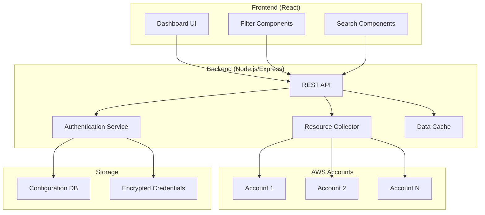

# Design Document

## Overview

The AWS Multi-Account Dashboard is a web application that provides a centralized view of AWS resources across multiple accounts. The system will use a modern web stack with a React frontend, Node.js backend, and secure credential management to aggregate and display resources from EC2, VPC, RDS, S3, ECS, EKS, and other AWS services.

The architecture follows a client-server pattern where the backend handles AWS API interactions and credential management, while the frontend provides an interactive dashboard interface with real-time filtering and search capabilities.

## Architecture

### High-Level Architecture



### Technology Stack

- **Frontend**: React 18 with TypeScript, Material-UI for components, React Query for data fetching
- **Backend**: Node.js with Express, AWS SDK v3 for JavaScript
- **Database**: SQLite for development, PostgreSQL for production (configuration and metadata)
- **Security**: bcrypt for password hashing, node-keytar for credential encryption
- **Caching**: Redis for resource data caching
- **Authentication**: JWT tokens for session management

## Components and Interfaces

### Frontend Components

#### Dashboard Layout
- **Header**: Navigation, account selector, refresh controls
- **Sidebar**: Service type filters, account filters, region filters
- **Main Content**: Resource grid/table with pagination
- **Status Bar**: Connection status, last refresh time, error indicators

#### Resource Components
- **ResourceCard**: Individual resource display with key metrics
- **ResourceTable**: Tabular view with sorting and filtering
- **ServiceTabs**: Tabs for different AWS services (EC2, RDS, S3, etc.)
- **FilterPanel**: Advanced filtering controls

### Backend Services

#### Resource Collector Service
```typescript
interface ResourceCollector {
  collectAllResources(accountId: string): Promise<ResourceCollection>
  collectEC2Resources(accountId: string): Promise<EC2Resource[]>
  collectRDSResources(accountId: string): Promise<RDSResource[]>
  collectS3Resources(accountId: string): Promise<S3Resource[]>
  collectECSResources(accountId: string): Promise<ECSResource[]>
  collectEKSResources(accountId: string): Promise<EKSResource[]>
  collectVPCResources(accountId: string): Promise<VPCResource[]>
}
```

#### Authentication Service
```typescript
interface AuthService {
  assumeRole(accountId: string, roleArn: string): Promise<AWSCredentials>
  validateCredentials(credentials: AWSCredentials): Promise<boolean>
  encryptCredentials(credentials: AWSCredentials): Promise<string>
  decryptCredentials(encryptedData: string): Promise<AWSCredentials>
}
```

#### API Endpoints
- `GET /api/accounts` - List configured accounts
- `POST /api/accounts` - Add new account configuration
- `PUT /api/accounts/:id` - Update account configuration
- `DELETE /api/accounts/:id` - Remove account configuration
- `GET /api/resources` - Get all resources with filtering
- `GET /api/resources/:accountId` - Get resources for specific account
- `POST /api/refresh` - Trigger manual refresh
- `GET /api/health` - System health check

## Data Models

### Account Configuration
```typescript
interface AccountConfig {
  id: string
  name: string
  accountId: string
  roleArn?: string
  accessKeyId?: string
  secretAccessKey?: string
  region: string
  isActive: boolean
  lastSync: Date
  createdAt: Date
  updatedAt: Date
}
```

### Resource Models
```typescript
interface BaseResource {
  id: string
  accountId: string
  region: string
  resourceType: string
  name: string
  arn: string
  tags: Record<string, string>
  status: string
  createdAt: Date
  lastUpdated: Date
}

interface EC2Resource extends BaseResource {
  instanceType: string
  state: string
  publicIp?: string
  privateIp: string
  vpcId: string
  subnetId: string
}

interface RDSResource extends BaseResource {
  engine: string
  engineVersion: string
  dbInstanceClass: string
  allocatedStorage: number
  endpoint?: string
  port: number
}

interface S3Resource extends BaseResource {
  bucketName: string
  region: string
  creationDate: Date
  versioning: boolean
  encryption: boolean
}
```

### Resource Collection
```typescript
interface ResourceCollection {
  accountId: string
  timestamp: Date
  resources: {
    ec2: EC2Resource[]
    rds: RDSResource[]
    s3: S3Resource[]
    ecs: ECSResource[]
    eks: EKSResource[]
    vpc: VPCResource[]
  }
  errors: CollectionError[]
}
```

## Error Handling

### Frontend Error Handling
- **Network Errors**: Display retry buttons and offline indicators
- **Authentication Errors**: Redirect to account configuration
- **Data Loading Errors**: Show error messages with refresh options
- **Validation Errors**: Inline form validation with clear error messages

### Backend Error Handling
- **AWS API Errors**: Log errors, return appropriate HTTP status codes
- **Credential Errors**: Secure error logging, generic error responses
- **Rate Limiting**: Implement exponential backoff and retry logic
- **Timeout Handling**: Set appropriate timeouts for AWS API calls

### Error Response Format
```typescript
interface ErrorResponse {
  error: {
    code: string
    message: string
    details?: any
    timestamp: Date
  }
}
```

## Testing Strategy

### Frontend Testing
- **Unit Tests**: Jest and React Testing Library for component testing
- **Integration Tests**: Test API integration and data flow
- **E2E Tests**: Cypress for critical user workflows
- **Visual Tests**: Storybook for component documentation and visual regression

### Backend Testing
- **Unit Tests**: Jest for service and utility function testing
- **Integration Tests**: Test AWS SDK integration with mocked services
- **API Tests**: Supertest for endpoint testing
- **Security Tests**: Test credential encryption and authentication flows

### Test Data Strategy
- **Mock AWS Responses**: Use AWS SDK mocks for consistent testing
- **Test Accounts**: Dedicated test AWS accounts with known resources
- **Data Fixtures**: Predefined resource data for frontend testing
- **Performance Tests**: Load testing for multiple account scenarios

### Continuous Integration
- **Pre-commit Hooks**: ESLint, Prettier, and basic tests
- **CI Pipeline**: Run full test suite on pull requests
- **Security Scanning**: Automated dependency vulnerability scanning
- **Code Coverage**: Maintain >80% code coverage threshold

## Security Considerations

### Credential Management
- **Encryption at Rest**: All AWS credentials encrypted using AES-256
- **Least Privilege**: IAM roles with minimal required permissions
- **Credential Rotation**: Support for automatic credential rotation
- **Secure Storage**: Use OS keychain for credential storage in development

### API Security
- **Authentication**: JWT tokens with expiration
- **Rate Limiting**: Prevent API abuse and AWS quota exhaustion
- **Input Validation**: Sanitize all user inputs
- **CORS Configuration**: Restrict cross-origin requests appropriately

### AWS Permissions
Required IAM permissions for cross-account access:
```json
{
  "Version": "2012-10-17",
  "Statement": [
    {
      "Effect": "Allow",
      "Action": [
        "ec2:DescribeInstances",
        "ec2:DescribeVpcs",
        "ec2:DescribeSubnets",
        "rds:DescribeDBInstances",
        "s3:ListAllMyBuckets",
        "s3:GetBucketLocation",
        "ecs:ListClusters",
        "ecs:DescribeClusters",
        "ecs:ListServices",
        "eks:ListClusters",
        "eks:DescribeCluster",
        "resource-groups:GetResources"
      ],
      "Resource": "*"
    }
  ]
}
```

## Performance Optimization

### Caching Strategy
- **Resource Cache**: Redis cache with 5-minute TTL for resource data
- **Account Cache**: Cache account configurations in memory
- **Query Optimization**: Implement efficient filtering and pagination
- **Lazy Loading**: Load resources on-demand based on user interaction

### Data Collection Optimization
- **Parallel Collection**: Collect resources from multiple accounts concurrently
- **Regional Optimization**: Query only active regions per account
- **Incremental Updates**: Track and update only changed resources
- **Batch Processing**: Group API calls to minimize AWS API requests

### Frontend Performance
- **Virtual Scrolling**: Handle large resource lists efficiently
- **Memoization**: Cache expensive component calculations
- **Code Splitting**: Lazy load components and routes
- **Bundle Optimization**: Minimize JavaScript bundle size